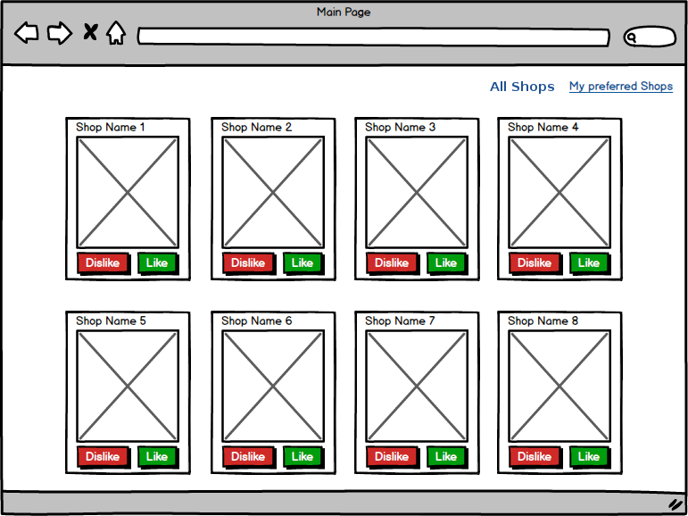
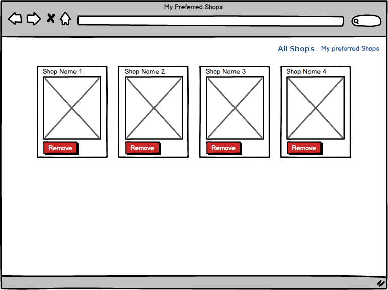

# Web Coding Challenge

## Idea of the app
The task is to implement an app that lists shops.

## Technologies to use

- Python/Django
  - Backend : Django
  - Frontend : VueJS, Bootstrap 3
  - Database : MongoDB

- Git & Git Flow

## Features
- As a User, I can sign up using my email & password
- As a User, I can sign in using my email & password
- As a User, I can display the list of shops
- As a User, I can like a shop, so it can be added to my preferred shops
  - Acceptance criteria: liked shops shouldn’t be displayed on the main page
- As a User, I can dislike a shop, so it won’t be displayed within the main page shops list.
- As a User, I can display the list of preferred shops
- As a User, I can remove a shop from my preferred shops list

## Mockups

## Application Data

A MongoDB dump with ~300 shops is provided. To import the data, you need to extract the zip file then execute the command below :

    mongorestore --db shops shops/

→→ A shop database will be created with a shops collection.

→ → Dump File : [here](dump-shops.zip)

## What we're looking for
- Clean, modular code structure, programming best practices, legibility.
- Clean git commit history with feature and release branches following git flow best practices
- Documentation, or how do we get your code running on our machine?

## Once you're done with the app

Put the code of your project on Github and send the URL to matt.gabrenya@gmail.com

## Questions?

If you have any questions or feedback, don't hesitate to contact me at matt.gabrenya@gmail.com

## Best Practices Resources

### Git Flow
- https://danielkummer.github.io/git-flow-cheatsheet/

### Django
- https://oncampus.oberlin.edu/webteam/2012/09/architecture-django-templates
- http://django-best-practices.readthedocs.io/en/latest/
