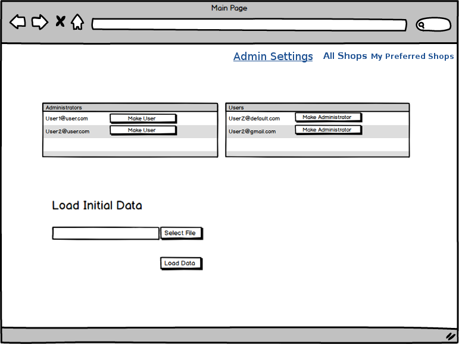

# Web Coding Challenge

## Idea of the app
The task is to implement an app that lists shops.

## Technologies to use

- Python/Django
  - Backend : Django
  - Frontend : VueJS, Bootstrap
  - Database : MySQL | SQLite | MongoDB

- Git & Git Flow

- Any additional libraries you want

## Features
- As an Administrator, I can promote other users to administrator
- As an Administrator, I can load shops to the database, from an uploaded json file (shops.json provided).
- As a User (or Administrator), I can sign up using my email & password
- As a User (or Administrator), I can sign in using my email & password
- As a User (or Administrator), I can display the list of shops
- As a User, I can like a shop, so it can be added to my preferred shops
  - Acceptance criteria: liked shops shouldn’t be displayed on the main page
- As a User, I can display the list of preferred shops
- As a User, I can remove a shop from my preferred shops list

## Mockups

(Note that the "dislike" button will be displayed but not actually do anything.)

(Note that the "make user" button will be displayed but not actually do anything. Also note the "Admin Settings" link is only shown to Administrators.)

## Application Data

A json file with 100 shops is provided. Administrators should be able to import this data into your application back-end.

## What we're looking for
- Clean, modular code structure, programming best practices, legibility.
- Clean git commit history with feature and release branches following git flow best practices
- Documentation, or how do we get your code running on our machine?

## Once you're done with the app

Put the code of your project on Github and send the URL to matt.gabrenya@gmail.com

## Questions?

If you have any questions or feedback, don't hesitate to contact me at matt.gabrenya@gmail.com

## Best Practices Resources

### Git Flow
- https://danielkummer.github.io/git-flow-cheatsheet/

### Django
- https://oncampus.oberlin.edu/webteam/2012/09/architecture-django-templates
- http://django-best-practices.readthedocs.io/en/latest/
